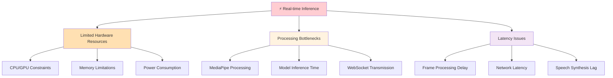
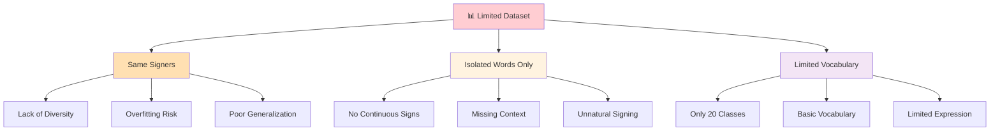
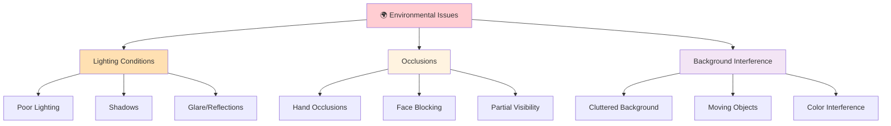
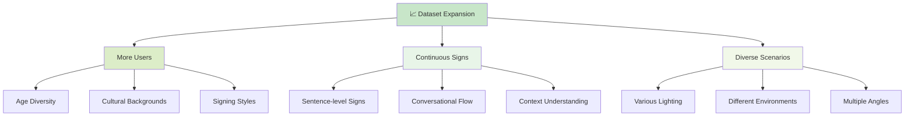
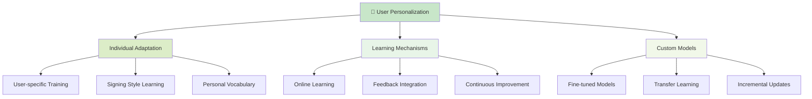
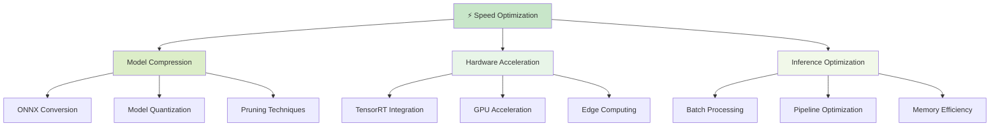
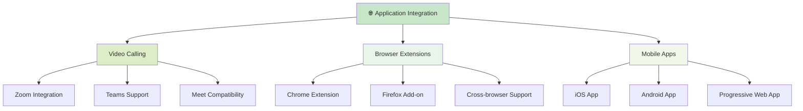
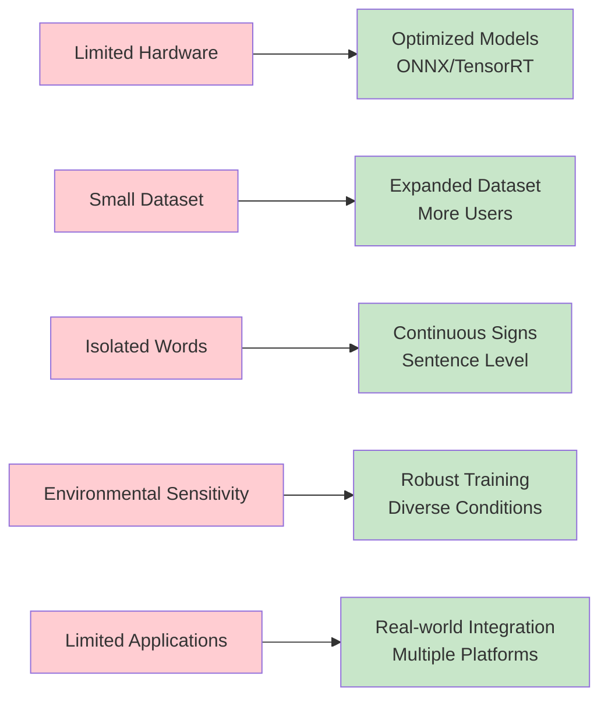
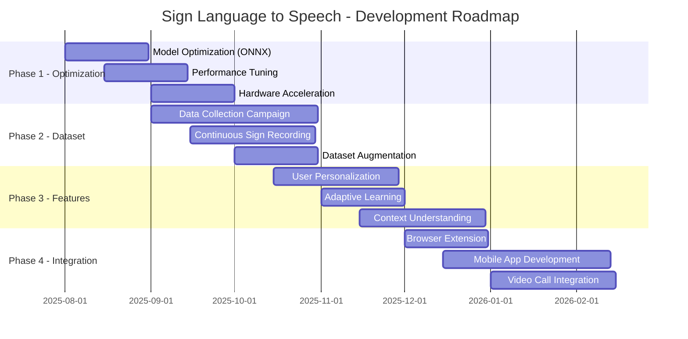
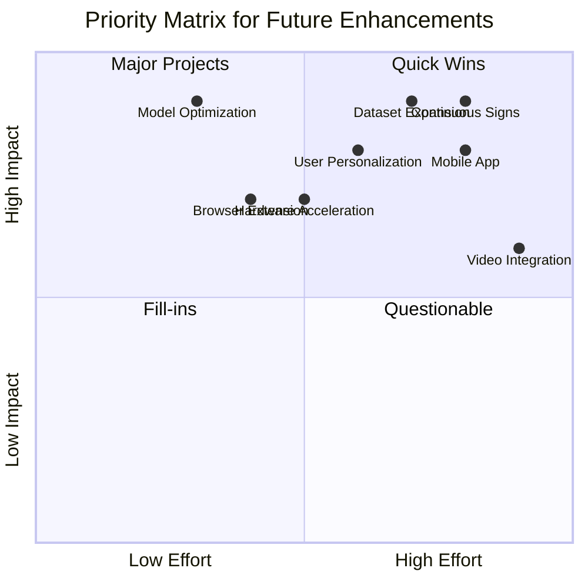

# 🚧 Challenges & Future Plans - Sign Language to Speech

## ⚠️ **CURRENT CHALLENGES**

### **Real-Time Performance Challenges**

### **Dataset Limitations**

### **Environmental Sensitivity**

---

## 🚀 **FUTURE ENHANCEMENT PLANS**

### **Dataset Expansion Strategy**

### **Personalization & Adaptation**

### **Performance Optimization**

### **Real-World Integration**

---

## 📊 **CHALLENGE vs SOLUTION MAPPING**

### **Current State → Future State**

---

## 🛣️ **DEVELOPMENT ROADMAP**

### **Phase-wise Implementation Plan**

---

## 📈 **SUCCESS METRICS & KPIs**

| Metric Category | Current State | Target Goal | Timeline |
|----------------|---------------|-------------|----------|
| **Performance** | ~500ms latency | <200ms latency | Q4 2025 |
| **Accuracy** | ~38% (20 classes) | >85% (100+ classes) | Q2 2026 |
| **Dataset Size** | 300 samples | 10,000+ samples | Q1 2026 |
| **User Base** | Limited testing | 1,000+ active users | Q3 2026 |
| **Platform Support** | Web only | Web + Mobile + Extensions | Q4 2026 |
| **Real-time FPS** | ~15 FPS | 30+ FPS | Q4 2025 |

---

## 🎯 **PRIORITY MATRIX**

### **Impact vs Effort Analysis**

---

## 🔮 **VISION STATEMENT**

> **"To create a universally accessible, real-time sign language translation system that breaks communication barriers and empowers deaf and hard-of-hearing communities worldwide."**

### **Core Principles**
- 🌍 **Accessibility First** - Technology for everyone
- ⚡ **Real-time Performance** - Instantaneous communication
- 🎯 **High Accuracy** - Reliable translations
- 🔧 **User-Centric Design** - Intuitive and adaptive
- 🌐 **Universal Integration** - Seamless platform support

---

*This roadmap represents our commitment to continuous improvement and innovation in sign language technology.* 🚀
