# 🔄 Sign Language to Speech - Complete Workflow Diagram

## 📊 **TRAINING PIPELINE**

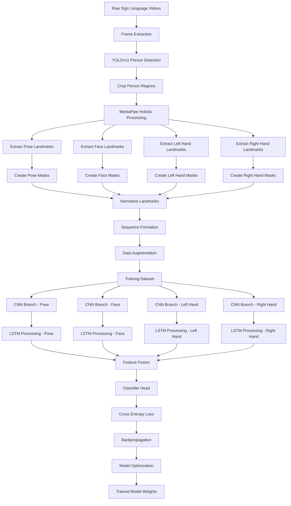

## 🌐 **REAL-TIME INFERENCE PIPELINE**

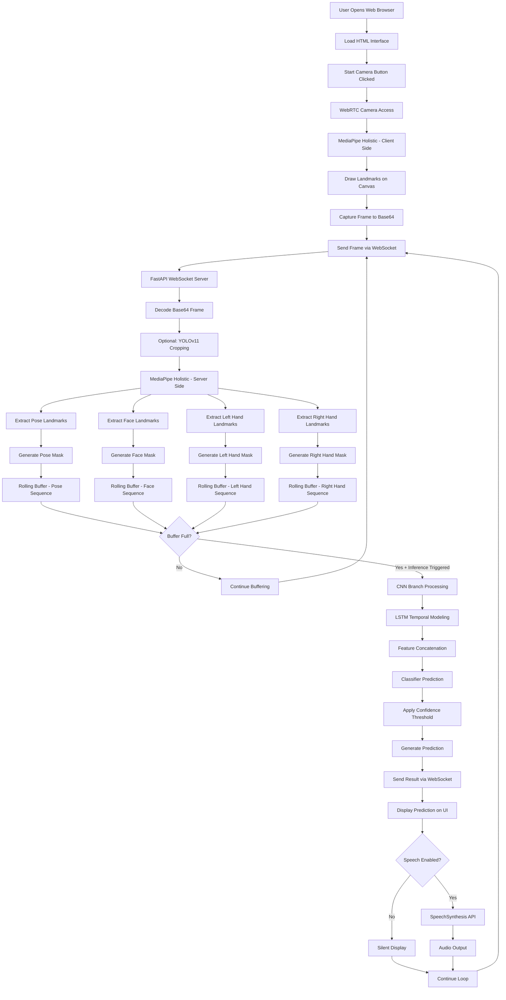

## 🧠 **DETAILED MODEL ARCHITECTURE FLOW**

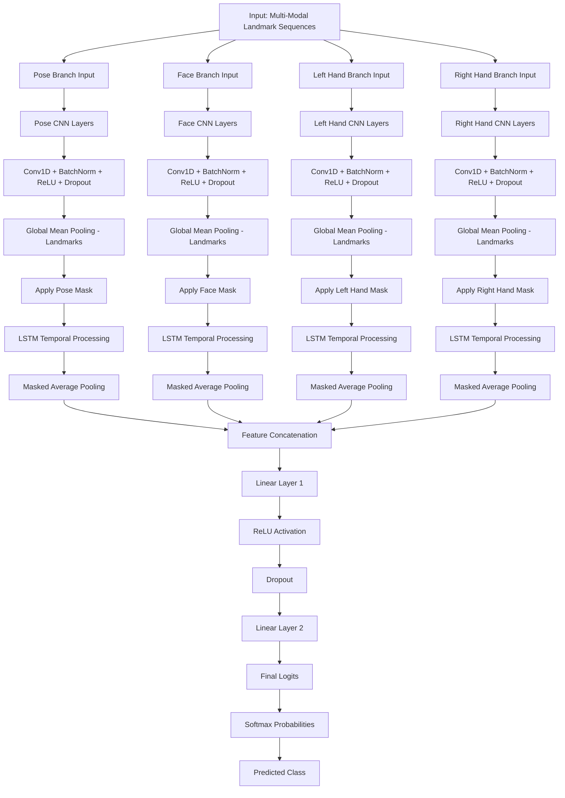

## 🔧 **DATA PREPROCESSING WORKFLOW**

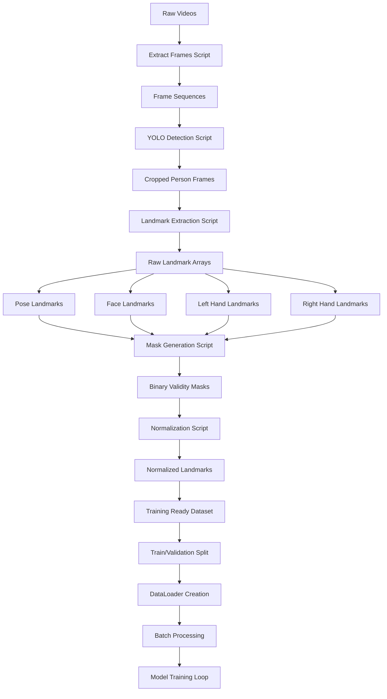

## 🎮 **USER INTERACTION FLOW**

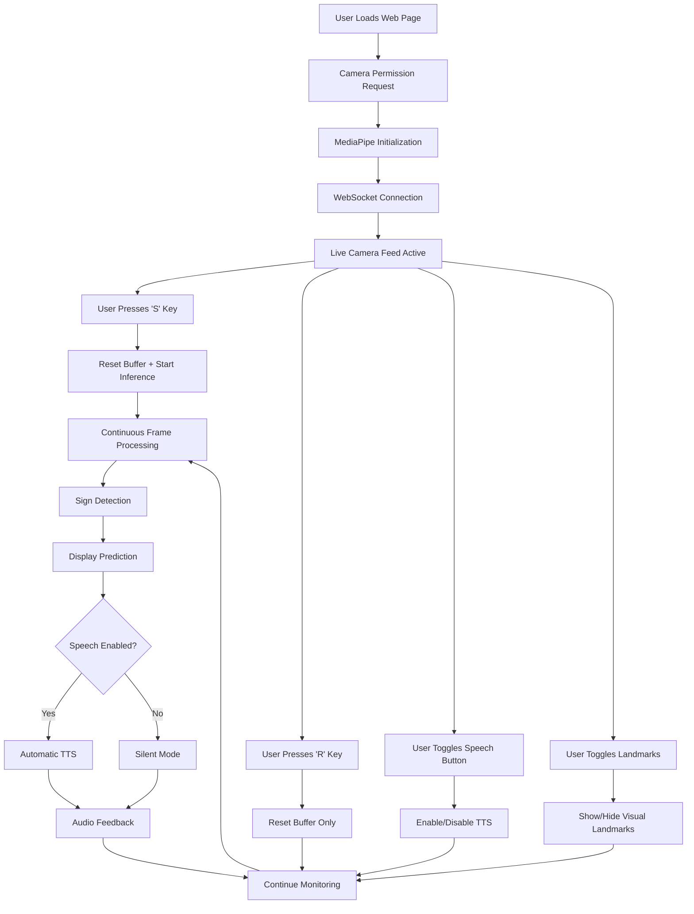

## 📱 **SYSTEM COMPONENT INTERACTION**

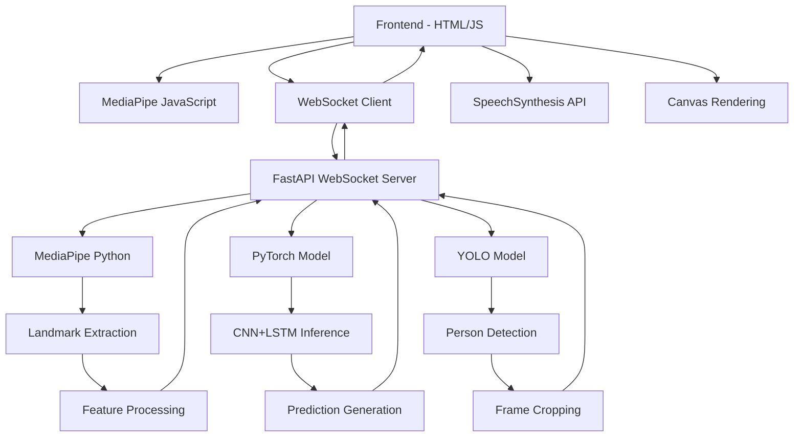

## 🔄 **COMPLETE END-TO-END FLOW**

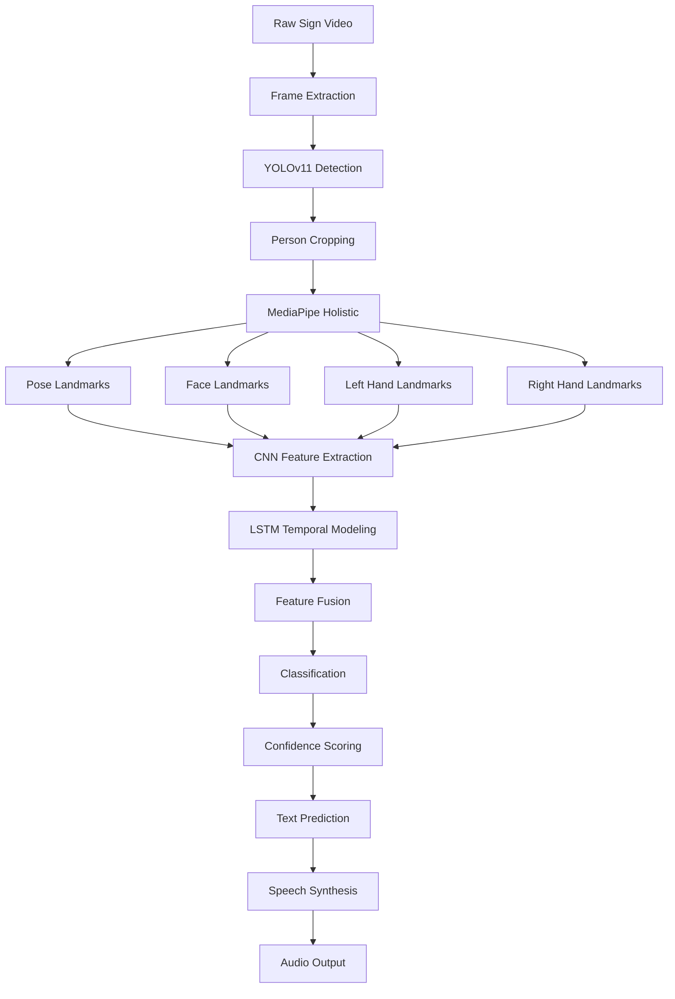

---

## 📋 **Key Workflow Stages Summary**

| Stage | Input | Process | Output |
|-------|-------|---------|--------|
| **Data Collection** | Raw videos | Manual recording | Video files |
| **Preprocessing** | Videos | Frame extraction → YOLO → MediaPipe | Landmark sequences |
| **Training** | Landmark data | CNN+LSTM training | Trained model |
| **Deployment** | Trained model | FastAPI server | Web service |
| **Inference** | Live camera | Real-time processing | Sign predictions |
| **User Experience** | Predictions | Display + TTS | Audio/visual feedback |

---

## 🎯 **Critical Decision Points**

1. **YOLO Detection**: Person present? → Crop or use full frame
2. **MediaPipe Processing**: Landmarks detected? → Generate masks
3. **Buffer Management**: Sequence complete? → Trigger inference
4. **Confidence Threshold**: Prediction reliable? → Display or ignore
5. **Speech Control**: Audio enabled? → Speak or stay silent

This workflow represents your complete Sign Language to Speech pipeline from raw data to final user interaction! 🚀

---

## 🎯 **SIMPLIFIED PRESENTATION WORKFLOW** 
*Perfect for slides and presentations*

### **Training Pipeline - Horizontal Flow**

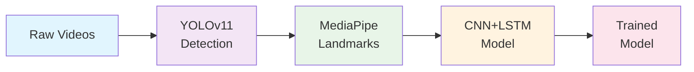

### **Real-Time Inference - Horizontal Flow**

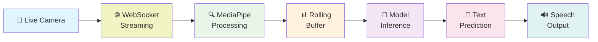

### **System Architecture - Simplified**

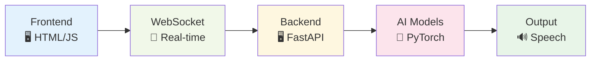

### **Data Flow - Core Components**

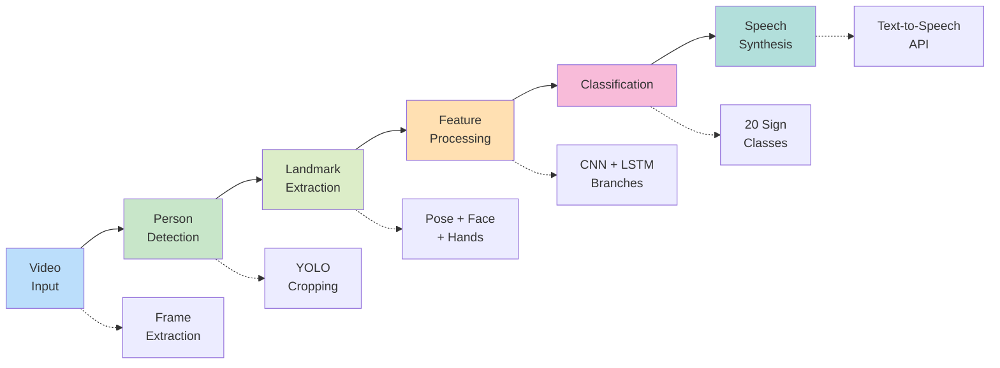

### **Model Architecture - Essential Flow**

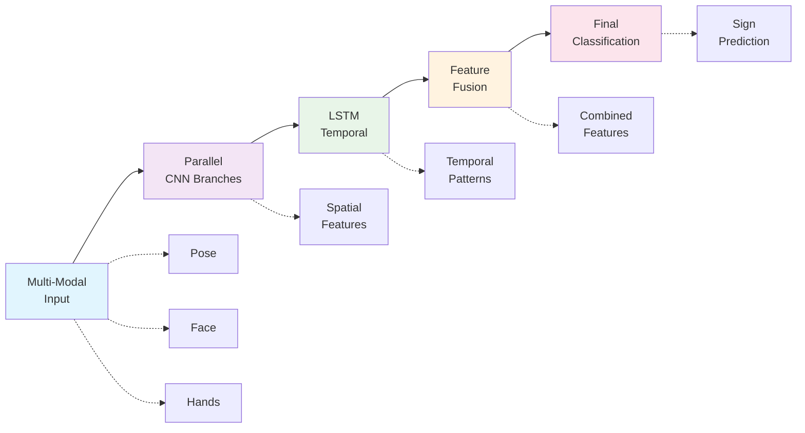

---

## 📋 **Quick Reference - Key Points**

| Component | Purpose | Technology |
|-----------|---------|------------|
| **YOLOv11** | Person Detection | Computer Vision |
| **MediaPipe** | Landmark Extraction | Google AI |
| **CNN** | Spatial Feature Learning | Deep Learning |
| **LSTM** | Temporal Sequence Modeling | Recurrent Neural Networks |
| **WebSocket** | Real-time Communication | Web Technology |
| **SpeechSynthesis** | Text-to-Speech | Browser API |

## 🎯 **One-Line Summary**
**Raw sign videos → AI preprocessing → Multi-modal CNN+LSTM → Real-time prediction → Speech output**
